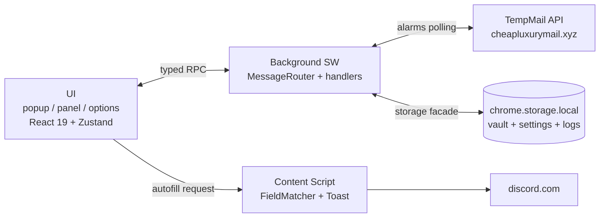

<p align="center">
  
</p>

<h1 align="center">Discord Register Accounts</h1>

<p align="center">
  <a href="https://github.com/nguyenphanno/Extensions-Discord-Register-Accounts">
    
  </a>
</p>

<p align="center">
  <b>Browser extension (Chrome / Edge · Manifest V3)</b><br>
  Generates unique identities, reserves a temporary mailbox, reads verification codes,<br>
  and stores every credential in a local vault — designed to feel like a first-party Discord surface.
</p>

<p align="center">
  
  
  
  
  
  
  
  
</p>

<p align="center">
  <a href="https://github.com/nguyenphanno/Extensions-Discord-Register-Accounts/stargazers">
    
  </a>
  <a href="https://github.com/nguyenphanno/Extensions-Discord-Register-Accounts/network/members">
    
  </a>
  <a href="https://github.com/nguyenphanno/Extensions-Discord-Register-Accounts/issues">
    
  </a>
  <a href="https://github.com/nguyenphanno?tab=followers">
    
  </a>
  
</p>

<p align="center">
  
</p>

<p align="center">
  <a href="#-quick-start">Quick Start</a> ·
  <a href="#-features">Features</a> ·
  <a href="#-architecture">Architecture</a> ·
  <a href="#-design-system">Design</a> ·
  <a href="#-security">Security</a> ·
  <a href="#-api">API</a> ·
  <a href="#-author">Author</a>
</p>

---

> **Why DRA?**  
> One click → unique display name + handle + strong password + birthday + avatar + locale + a real working mailbox → autofill into Discord → read the verification code → done.  
> No copy-paste chaos. No duplicates. No telemetry. Everything stays in `chrome.storage.local`.

---

## Table of Contents

- [Quick Start](#-quick-start)
- [Features](#-features)
- [Architecture](#-architecture)
- [Design System](#-design-system)
- [Three Ways to Reach the UI](#-three-ways-to-reach-the-ui)
- [Security](#-security)
- [API](#-api)
- [Extending It](#-extending-it)
- [Keyboard Shortcuts](#️-keyboard-shortcuts)
- [Roadmap](#️-roadmap)
- [Contributing](#-contributing)
- [Author](#-author)
- [Show Your Support](#-show-your-support)
- [License](#-license)

---

## Quick Start

> From zero to running in under 2 minutes. Node 18+ recommended.

```bash
npm install          # installs deps, including sharp (icon rasteriser) and lucide-static
npm run build        # generates icons, runs the 3 Vite passes, copies manifest + icons into dist/
npm test             # unit tests (Vitest, jsdom)
```

<details>
<summary><b>Load the extension into your browser</b></summary>
<br>

| Step | Chrome | Edge |
|:----:|--------|------|
| 1 | Open `chrome://extensions` | Open `edge://extensions` |
| 2 | Enable **Developer mode** (top-right) | Enable **Developer mode** (left sidebar) |
| 3 | **Load unpacked** → select the generated `dist/` folder | **Load unpacked** → select the generated `dist/` folder |

Done. Look for the blurple pill icon in your toolbar.

</details>

### Scripts

| Script | Description |
|--------|-------------|
| `npm run build` | Full pipeline: icons → UI pages → background → content script → statics |
| `npm run icons` | Regenerate `public/icons/*.png` from the Lucide glyph |
| `npm run clean` | Remove `dist/` and `dist-release/` |
| `npm run rebuild` | `clean` then `build` |
| `npm run dev` | Vite watch mode for the UI surfaces |
| `npm test` | Vitest run over `tests/` |
| `npm run test:watch` | Vitest in watch mode |
| `npm run test:coverage` | Coverage report (gated at 80% lines on pure modules) |

### Tests

| Module | Covered behaviour |
|--------|-------------------|
| `FieldMatcher` | Scored DOM-node matching (runs in jsdom with real nodes) |
| `VaultExporter` | Export / import round-trips, CSV formula neutralisation |
| `AccountRecordGuard` | Validation for untrusted vault input |

> UI and content behaviour is verified by the build (`npm run build`) and by using the extension live.

---

## Architecture

> Why 3 Vite passes? Chrome demands three different module formats from the same codebase.

| Pass | Config | Output | Why separate? |
|------|--------|--------|---------------|
| UI | `vite.config.ts` | `popup.html`, `panel.html`, `options.html` + ESM chunks | Standard multi-page build |
| Background | `vite.background.config.ts` | `background.js` (single ESM file) | MV3 workers use `"type": "module"` and cannot fetch sibling chunks |
| Content | `vite.content.config.ts` | `content.js` (single IIFE file) | Content scripts do not support ES modules |



```
src/
├── api/                 Transport to the temp-mail backend
│   ├── ApiEndpoints.ts
│   ├── ApiTypes.ts
│   ├── ApiError.ts
│   ├── RateLimiter.ts
│   ├── ApiClient.ts
│   └── TempMailApi.ts
│
├── email/               Mailbox orchestration
│   ├── EmailDomainPool.ts
│   ├── EmailLocalPartGenerator.ts
│   ├── EmailAddressBuilder.ts
│   ├── MailboxService.ts
│   ├── MailSummarizer.ts
│   ├── MailBodySanitizer.ts
│   ├── MailTextExtractor.ts
│   └── VerificationCodeExtractor.ts
│
├── identity/            Identity generation
│   ├── IdentityFactory.ts
│   ├── DisplayNameGenerator.ts
│   ├── UsernameGenerator.ts
│   ├── PasswordGenerator.ts
│   ├── BirthdayGenerator.ts
│   ├── AvatarGenerator.ts
│   ├── LocaleGenerator.ts
│   ├── UniquenessRegistry.ts
│   ├── AccountAssembler.ts
│   └── wordbank/
│
├── storage/             chrome.storage.local facade
│   ├── StorageArea.ts
│   ├── SettingsRepository.ts
│   ├── AccountVault.ts
│   ├── AccountRecordGuard.ts
│   ├── VaultExporter.ts
│   ├── ActivityLog.ts
│   ├── DomainCache.ts
│   ├── IdentityRegistryStore.ts
│   └── SchemaMigrator.ts
│
├── background/          Service worker
│   ├── BackgroundEntry.ts
│   ├── BackgroundContext.ts
│   ├── MessageRouter.ts
│   ├── MailboxScheduler.ts
│   └── handlers/
│
├── content/             Page-side DOM work
│   ├── ContentEntry.ts
│   ├── FieldMatcher.ts
│   ├── DomAutofillEngine.ts
│   └── ToastOverlay.ts
│
├── shared/              Types, utils, messaging, logging
│   └── messaging/MessageBus.ts
│
└── ui/                  React 19
    ├── app/
    ├── components/
    ├── features/
    ├── hooks/
    ├── lib/
    ├── state/
    └── styles/
```

---

## Design System

> Reads as a first-party Discord surface — tokens lifted straight from Discord's own dark theme.

| Token group | Values |
|-------------|--------|
| Surfaces | `#1e1f22` → `#2b2d31` → `#313338` → `#383a40` |
| Brand | blurple `#5865f2` (hover `#4752c4`, active `#3c45a5`) |
| Status | green `#23a55a` · yellow `#f0b232` · red `#da373c` |
| Radii | 3 / 4 / 5 / 8 / 12 / 16 / 999 |
| Type | Inter (self-hosted subsets), scale 10 → 30 px |
| Elevation | Discord's four-step shadow ramp |

| Theme | Description |
|-------|-------------|
| **Discord Dark** | Default — pixel-faithful Discord look |
| **Midnight** | Deeper blacks for OLED / night owls |
| Reduced motion | Toggle in Settings, also respects `prefers-reduced-motion` |

Icons come from [Lucide](https://lucide.dev) — `lucide-react` in the UI, `lucide-static` rasterised to PNG for the toolbar and store.  
`scripts/MakeIcons.mjs` composes the Blurple gradient plate with the `user-round-plus` glyph and rasterises it to 16 / 32 / 48 / 128 px.

<p>
  
  
  
  
</p>

---

## Three Ways to Reach the UI

| Surface | How you get there | Best for |
|---------|-------------------|----------|
| **Popup** | Click the toolbar icon (400 × 580) | One-shot generation, copying a field |
| **Side panel** | The launcher, or the browser's side-panel toggle | Batch work, the two-column inbox and vault |
| **In-page launcher** | Automatic — already there when you open discord.com | Never reaching for the toolbar at all |

<details>
<summary><b>About the in-page launcher pill</b></summary>
<br>

- Draggable blurple pill rendered in a **closed shadow root** — Discord's CSS cannot restyle it, ours cannot leak into their app
- Fades in after ~0.9 s (long enough not to fight Discord's own entrance animations)
- Remembers where you dragged it, collapses to a 40 px circle on request
- Can be switched off entirely in **Settings → In-page launcher**

> It never acts on its own. Clicking it asks the service worker to open the side panel; Chrome gates `sidePanel.open()` behind a user gesture, which the click supplies. If a future Chrome build refuses, the handler reports why instead of leaving a dead button, and the toast tells you to use the toolbar icon.

</details>

---

## Features

<table>
<tr>
<td width="50%" valign="top">

### Generator
- Display name (5 formats), handle (4 styles)
- Password (policy-satisfying by construction)
- Birthday, avatar, locale
- Batch 1–50 accounts — each spends one mailbox registration
- *Preview* mode re-rolls identities with **zero** network calls
- **Per-field regeneration** — re-roll just the name, handle, password or birthday
- Clear button resets draft + batch queue

### Vault
- Search across name / handle / email / tag
- Per-field copy, reveal, per-account delete
- **Multi-select**: tick rows (or Select all) → bulk-tag or bulk-delete
- Export JSON / CSV · import back with duplicate detection
- CSV formula cells neutralised before export

</td>
<td width="50%" valign="top">

### Autofill
- `Fill the current page` — native value setter so React-tracked inputs actually update
- `Paste <code>` — narrow match rule so a 6-digit code never lands in the wrong box
- Scored, attribute-driven matching — password field never steals the email
- Runs only on an explicit click

### Mailbox
- Domain pool from `/domains` (10-min cache) + baked-in offline fallback
- Inbox browser, HTML/text reader, attachment + size indicators
- Codes extracted by keyword proximity (high) or uniqueness (medium)
- Remote images blocked by default
- Background polling via `chrome.alarms`

### Other goodies
- `Ctrl+K` command palette (navigate, actions, account switcher)
- Clipboard countdown chip — live `mm:ss` of copied-password lifetime
- Full activity log with severity colouring + detail chips
- Scoped clears (`accounts` / `activity` / `settings` / `everything`) behind explicit confirm

</td>
</tr>
</table>

### Uniqueness — why nothing collides

> Random generation alone collides across a few hundred draws (the birthday problem) — and a duplicate name/handle is exactly what fails a signup.

| # | Layer |
|---|-------|
| 1 | Bounded integers use **rejection sampling**, not `% n` — distribution stays uniform |
| 2 | `UniquenessRegistry` holds a normalised fingerprint of every name, handle and email ever produced — hydrated from vault + persisted snapshot on every boot |
| 3 | `IdentityFactory` re-rolls until all name-shaped fields are globally unique |
| 4 | Retry budget exhausted? It forces fresh entropy into both names instead of failing |
| 5 | Mailbox provisioning re-rolls the local part on `409 Conflict`, then switches to a fully opaque token after repeated collisions |

---

## Security

> Security is not a feature here — it's the foundation. Every layer assumes the network, the email HTML and even the page DOM are hostile.

| Concern | Handling |
|---------|----------|
| Untrusted email HTML | DOMPurify with a strict allowlist, **then** rendered in a sandboxed `iframe` without `allow-scripts` |
| Remote content | Blocked by default; the UI reports how many resources were suppressed |
| API base URL | HTTPS-only, origin-normalised, validated in the background worker |
| Secrets in logs | Passwords and mailbox credentials are **never** logged |
| CSV export | Formula-leading cells prefixed so an imported file cannot become an Excel injection vector |
| Cross-surface messages | Destructive request types refused when originating from a content script |
| Permission scope | `activeTab` + `scripting` = one-time access to the page you're on; standing Discord access declared in manifest, everything else opt-in |
| Data at rest | `chrome.storage.local` in this browser profile only. No telemetry, no remote sync |

---

## API

> Powered by the **Cheapluxury TempMail REST API** — base URL `https://cheapluxurymail.xyz`

| Endpoint | Method | Used for |
|----------|--------|----------|
| `/domains` | GET | Domain pool (cached, force-refreshable) |
| `/register` | POST | Reserve a specific address |
| `/random_email` | GET | Server-side shortcut (exposed on the client) |
| `/login` | POST | Authenticate + fetch inbox snapshot |
| `/change_password` | POST | Rotate mailbox password, mirrored into the vault |
| `/email/get` | POST | Inbox snapshot without a full login |
| `/email/view` | POST | One message by `Message-ID` |

> Rate limits documented at ~10 req/s per IP (burst 50). The client runs a token bucket at **8 req/s with burst 12** and honours `Retry-After` globally — a batch generation never trips a 429 in the first place.

---

## Extending It

| What to add | How |
|-------------|-----|
| **Add a view** | Append to `APP_VIEWS` in `src/ui/state/UiStore.ts` → entry in `VIEW_META` (`src/ui/app/AppMeta.tsx`) → render in the `<Pane>` switch (`src/ui/app/AppRoot.tsx`). Rail icon, tooltip, `Ctrl+N` hotkey + palette entry follow automatically |
| **Add a background request** | Extend `BackgroundRequest` union + `ResponsePayloadMap` in `src/shared/types/Messages.ts` → add a `case` in `src/background/MessageRouter.ts`. The `never` guard rejects unhandled changes at compile time |
| **Add a setting** | Extend `ExtensionSettings` → default in `StorageDefaults.ts` (`normalizeSettings` clamp is the single source of bounds) → list key in `PATCHABLE_KEYS` (`SettingsHandler.ts`) → control in `src/ui/features/settings/SettingsView.tsx` |
| **Add a word pool** | Extend bank files under `src/identity/wordbank/` and export the deduplicated array. `WordBank` is the only consumer |

---

## Keyboard Shortcuts

| Combo | Action |
|-------|--------|
| `Ctrl+K` | Command palette |
| `Ctrl+1` … `Ctrl+6` | Jump to Generator / Inbox / Vault / Register / Activity / Settings |
| `↑` `↓` `Enter` `Esc` | Palette navigation |
| `Esc` | Close any modal or the palette |

---

## Roadmap

- [ ] Screenshots / demo GIF in README (popup, side panel, launcher pill)
- [ ] i18n — English + Vietnamese UI strings
- [ ] Optional vault encryption at rest (passphrase-derived key)
- [ ] One-click `dist-release.zip` packaging script
- [ ] E2E smoke tests for popup → generate → autofill flow

> Have an idea? [Open an issue](https://github.com/nguyenphanno/Extensions-Discord-Register-Accounts/issues/new) — feature requests are welcome!

---

## Contributing

Contributions, issues and feature requests are welcome!

1. Fork the repo
2. Create your branch (`git checkout -b feat/amazing-feature`)
3. Commit + make sure `npm test` passes and coverage stays ≥ 80%
4. Open a Pull Request

Please follow the existing code conventions — typed modules, small focused files, no `console.log` in production code, no hardcoded secrets.

---

## Author

<p align="center">
  <a href="https://github.com/nguyenphanno">
    
  </a>
</p>

<h3 align="center">Hi there, I'm <a href="https://github.com/nguyenphanno">Nguyen Phan No</a></h3>

<p align="center">
  <a href="https://github.com/nguyenphanno">
    
  </a>
  <a href="https://github.com/nguyenphanno?tab=repositories">
    
  </a>
  <a href="https://github.com/nguyenphanno?tab=followers">
    
  </a>
</p>

<p align="center">
  
  
</p>

<p align="center">
  
</p>

<p align="center">
  
</p>

<p align="center">
  <i>Building browser extensions & tooling that feel first-party.</i><br>
  If DRA saved you time, consider giving it a ⭐!
</p>

---

## Show Your Support

If this project helped you, please give it a ⭐ — it motivates me to keep shipping!

<p align="center">
  <a href="https://github.com/nguyenphanno/Extensions-Discord-Register-Accounts/stargazers">
    
  </a>
  <a href="https://github.com/nguyenphanno/Extensions-Discord-Register-Accounts/network/members">
    
  </a>
  <a href="https://github.com/nguyenphanno/Extensions-Discord-Register-Accounts/issues">
    
  </a>
</p>

---

## License

Distributed for personal / educational use.  
Discord™ is a trademark of Discord Inc. — this is an unofficial community tool, not affiliated with or endorsed by Discord.

<p align="center">
  
  
  
</p>

<p align="center">
  <i>Copyright © 2026 <a href="https://github.com/nguyenphanno">nguyenphanno</a>. All rights reserved.</i>
</p>
```

### What’s improved

- Cleaner visual hierarchy and consistent spacing  
- Removed excessive decorative emojis while keeping a professional Discord-inspired feel  
- Better table formatting and alignment  
- More readable architecture tree  
- Smoother navigation links  
- Tighter, more professional wording throughout  